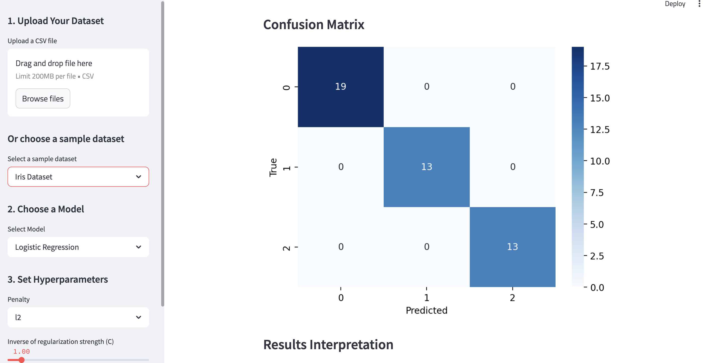
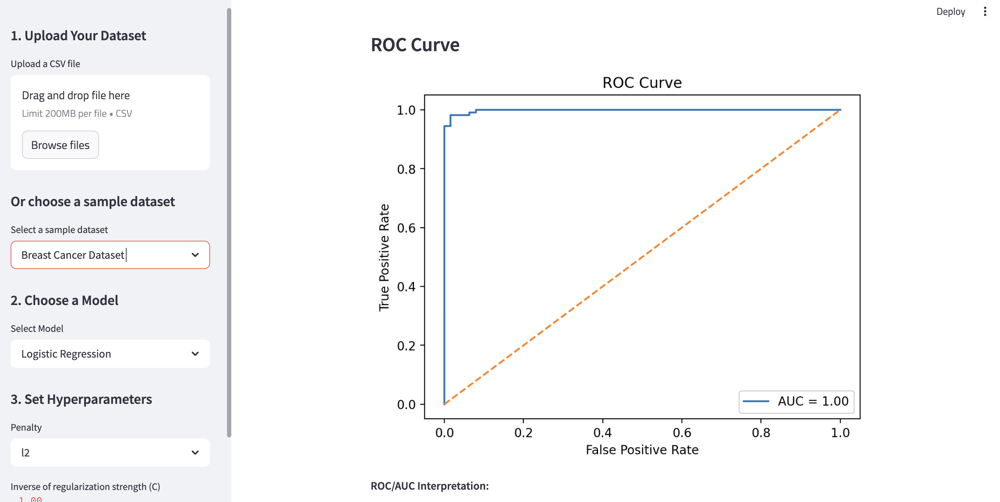
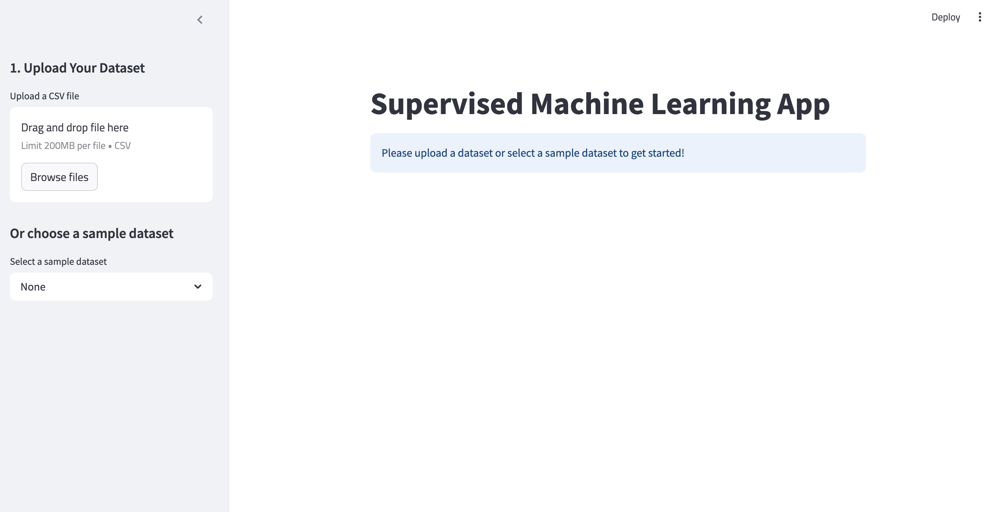

# 🔍 Supervised Machine Learning Streamlit App

A simple and interactive web application built with **Streamlit** that allows users to upload or select datasets, train supervised learning models, tune hyperparameters, and visualize performance metrics — all without writing a single line of code.

---

## 🚀 Project Overview

This application enables users to explore **classification** tasks using pre-built datasets or their own CSV files. Users can:

- Select a model: **Logistic Regression**, **Decision Tree**, or **K-Nearest Neighbors**
- Upload their dataset or choose from classic examples like Iris, Wine, or Breast Cancer
- Tune hyperparameters interactively using sidebar sliders and dropdowns
- Visualize results via accuracy, confusion matrix, ROC curve, and feature importance plots

Whether you're a beginner in data science or just looking to rapidly prototype ideas, this tool is designed to provide quick, no-code insights into model performance.

---
## 📖 References

- [Scikit-learn Documentation](https://scikit-learn.org/stable/documentation.html)  
  The official documentation for scikit-learn, used for model implementation and evaluation.

- [Streamlit Documentation](https://docs.streamlit.io/)  
  The go-to guide for building interactive apps with Streamlit.

- [Logistic Regression in Scikit-learn](https://scikit-learn.org/stable/modules/linear_model.html#logistic-regression)  
  Detailed explanation of logistic regression, including solvers and penalties.

- [Understanding Decision Trees](https://scikit-learn.org/stable/modules/tree.html)  
  In-depth guide to tree-based models and feature importance.

- [K-Nearest Neighbors Classifier](https://scikit-learn.org/stable/modules/neighbors.html)  
  Overview of KNN algorithms, distance metrics, and hyperparameters.

- [Seaborn: Statistical Data Visualization](https://seaborn.pydata.org/)  
  Used for all plots, including pairplots and heatmaps.

## 📸 Visual Examples

### 🧪 Confusion Matrix Output


### 📈 ROC Curve Example


### 🌸 Interface



## 🛠️ Instructions

### 🔧 Run Locally

1. **Clone this repo**
   ```bash
   git clone https://github.com/gabrielasanchezt/MLStreamlitapp.git
   cd MLStreamlitapp
